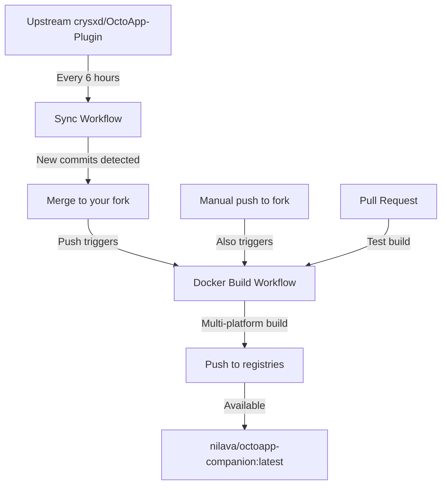

# Fork Setup Guide for nilava/OctoApp-Plugin

This guide documents the setup for your Docker-enabled fork of OctoApp-Plugin.

## 🚀 Quick Setup Checklist

### 1. Configure Repository Secrets
Go to `https://github.com/nilava/OctoApp-Plugin/settings/secrets/actions` and add:

- [ ] `DOCKERHUB_USERNAME`: `nilava`
- [ ] `DOCKERHUB_TOKEN`: Your Docker Hub access token
  - Get it from: https://hub.docker.com/settings/security
  - Create a new access token with `Read & Write` permissions

### 2. Enable GitHub Actions
Go to `https://github.com/nilava/OctoApp-Plugin/actions` and:
- [ ] Enable Actions if not already enabled
- [ ] Verify workflows are present:
  - `docker.yml` - Builds and pushes Docker images
  - `sync-upstream.yml` - Syncs with upstream repository

### 3. Configure Docker Hub Repository
Go to `https://hub.docker.com/` and:
- [ ] Create repository `nilava/octoapp-companion` if it doesn't exist
- [ ] Set description: "OctoApp Companion for Klipper/Moonraker - Docker Container"
- [ ] Add README from this repository

## 📦 What Gets Built

Your fork will automatically build and publish:

### Docker Images
- **Docker Hub**: `nilava/octoapp-companion:latest`
- **GitHub Container Registry**: `ghcr.io/nilava/octoapp-plugin:latest`

### Supported Platforms
- `linux/amd64` - Standard x86-64 systems
- `linux/arm64` - 64-bit ARM (Raspberry Pi 4, Apple Silicon)  
- `linux/arm/v7` - 32-bit ARM (Raspberry Pi 3 and older)

### Tags
- `latest` - Latest stable from release branch
- `main` - Latest from main branch
- `v*.*.*` - Semantic version tags
- `pr-*` - Pull request builds

## 🔄 Automation Flow



## 📝 Pushing Changes to Your Fork

1. **Clone your fork locally:**
```bash
git clone https://github.com/nilava/OctoApp-Plugin.git
cd OctoApp-Plugin
```

2. **Add these Docker files:**
```bash
# Copy all the Docker-related files we created
git add Dockerfile
git add docker-compose.yml
git add .dockerignore
git add .env.example
git add .github/workflows/docker.yml
git add .github/workflows/sync-upstream.yml
git add docs/DOCKER.md
git add README.md  # Updated version
git add FORK_SETUP.md
```

3. **Commit and push:**
```bash
git commit -m "Add Docker support for OctoApp Companion

- Multi-stage Dockerfile with security best practices
- Automated GitHub Actions for multi-platform builds
- Support for AMD64, ARM64, and ARMv7 architectures
- Automatic upstream sync every 6 hours
- Published to Docker Hub as nilava/octoapp-companion
- Environment-based configuration for Moonraker URL
- Comprehensive documentation"

git push origin release
```

## 🎯 Usage for End Users

Once published, users can run your Docker image:

### Quick Start
```bash
docker run -d \
  --name octoapp-companion \
  -e MOONRAKER_URL=http://192.168.1.100:7125 \
  nilava/octoapp-companion:latest
```

### Docker Compose
```yaml
services:
  octoapp-companion:
    image: nilava/octoapp-companion:latest
    environment:
      - MOONRAKER_URL=http://192.168.1.100:7125
    restart: unless-stopped
```

## 🔍 Monitoring

### Check Build Status
- Actions: https://github.com/nilava/OctoApp-Plugin/actions
- Docker Hub: https://hub.docker.com/r/nilava/octoapp-companion/tags

### View Sync Status
Check the "Sync Upstream" workflow runs to see when updates were pulled.

## 🛠️ Maintenance

### Manual Sync with Upstream
```bash
# If automatic sync fails, run manually:
git remote add upstream https://github.com/crysxd/OctoApp-Plugin.git
git fetch upstream
git checkout release
git merge upstream/release
git push origin release
```

### Force Rebuild
1. Go to Actions tab
2. Select "Build and Push Docker Image"
3. Click "Run workflow"
4. Select branch and run

## 📊 Success Indicators

- [ ] Docker workflow shows green checkmarks
- [ ] Images appear on Docker Hub: https://hub.docker.com/r/nilava/octoapp-companion
- [ ] Users can pull and run: `docker pull nilava/octoapp-companion:latest`
- [ ] Upstream changes automatically trigger rebuilds

## 🆘 Troubleshooting

### Build Fails
- Check Actions logs for specific errors
- Verify Docker Hub credentials are correct
- Ensure Dockerfile syntax is valid

### Sync Fails
- Check if upstream branch structure changed
- Manually sync and resolve conflicts
- Update sync workflow if needed

### Users Can't Pull Image
- Verify Docker Hub repository is public
- Check image was successfully pushed
- Confirm tag names are correct

## 📈 Next Steps

1. **Star and Watch** upstream repository for updates
2. **Create releases** in your fork for version tracking
3. **Add badges** to README showing build status
4. **Document** any fork-specific features you add
5. **Engage** with the community for feedback

---
*This fork is maintained to provide Docker images for OctoApp Companion*